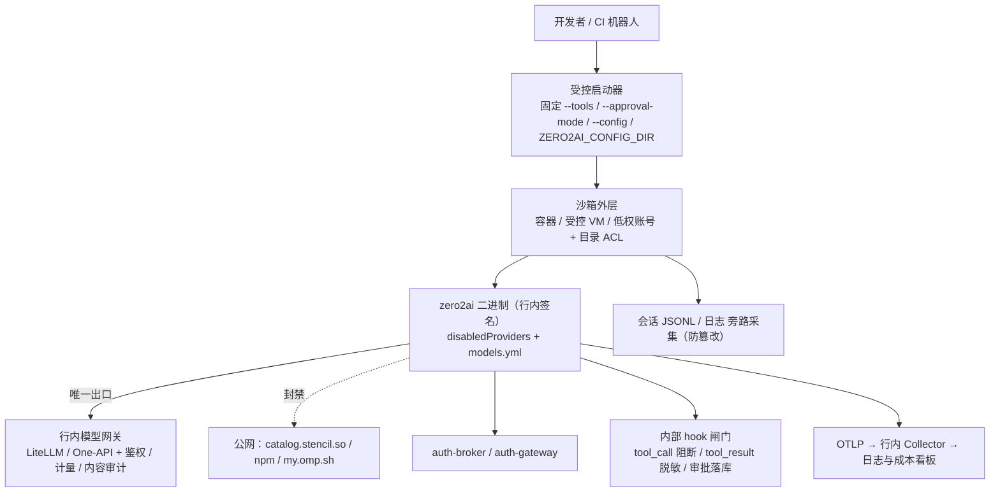

# zero2ai / oh-my-pi 内化方案（内部项目）

| 项 | 值 |
|---|---|
| 目标项目 | zero2ai / oh-my-pi（AI 编码代理 CLI，MIT） |
| 上游基线 | v18.2.1（TS 4930 文件 / ~1.56M 行，Rust 26 万行） |
| 文档性质 | 行内内化立项方案（方向 + 计划 + 验收） |
| 适用读者 | 立项评审、架构、安全、DevOps、研发效能 |

> 本文所有技术判断均基于对仓库源码的实地核查，关键结论附带文件与符号位置，便于复核。

---

## 0. 执行摘要（管理层一页）

**要做什么**：把开源的 AI 编码代理（MIT）内化为行内可控版本，让研发在**数据不出域、用量可计量、操作可审计、风险可阻断**的前提下使用。

**为什么可行**：许可为 MIT（仅需保留版权声明）；模型接入、代理、私有 CA/mTLS、集中凭据、工具审批、审计遥测等企业要素**均为开箱能力**，约 80% 的收敛需求无需改源码。

**三个必须正面处理的缺口**：

| 缺口 | 事实 | 应对 |
|---|---|---|
| 无管理员托管策略层 | 审批默认 `yolo`，配置优先级为 `runtime flags > --config > 项目 > 全局`，**用户加 `--yolo` 即可抬过全部配置** | 受控启动器 + 不暴露二进制 + 目录 ACL + 终端白名单（配置层本身无强制力） |
| 无 OS 级沙箱 | 审批通过后 `bash`/`eval`/`browser` 继承宿主全部权限；`zero2ai-iso` 是子代理工作区隔离，**非安全边界** | 沙箱由虚拟化团队提供（VM/容器 + egress 白名单） |
| 默认存在外联面 | 启动版本检查、`catalog.stencil.so` 目录刷新（无开关）、Auto-QA、市场检查、share/collab | 网络侧封禁 + 少量源码补丁（L2 清单 6 项） |

**投入与产出**：核心 **2–3 人 × 6–9 人月**（另需虚拟化/安全/法务共建），**4–6 个月达到生产可用**（P4）。年度运行成本主要是模型推理费（由网关计量）与平台资源（镜像库、collector、沙箱）。

**要的资源**：① 内网模型网关（或复用现有 LiteLLM）② 内网 npm/crates 镜像与制品库 ③ 虚拟化资源用于沙箱 ④ 日志/可观测平台接入 ⑤ Windows 代码签名证书 ⑥ 法务对三处 copyleft 例外的书面结论。

**成功标准（可验证）**：隔离网可完整构建运行；抓包除网关外零连接；`agent.db` 无明文凭据；高危操作被阻断且留痕；成本可归集到人/项目；季度 rebase 上游后补丁全量应用。

---

## 0.5 当前完成度

| 里程碑 | 状态 | 证据 |
|---|---|---|
| 表面内化（命令/目录/环境变量/品牌） | ✅ 已完成 | CLI 为 `zero2ai`、配置目录 `.zero2ai`、ZERO2AI 标记与字标；1511 文件改动 + 12 处路径改名 |
| **深度改名第二阶段**（包作用域/crate/环境变量/模型库/遥测） | ✅ 已完成 | 作用域 `@oh-my-pi/*` → `@zero2ai/*` 且去 `pi-`/`omp` 前缀（如 `@zero2ai/coding-agent`）；crate `pi-*` → `zero2ai-*`；环境变量 `PI_*` → `ZERO2AI_*`；`omptype` → `schema`；遥测扩展属性 `pi.gen_ai.*` → `zero2ai.gen_ai.*`；4013 文件改写 + 19 处路径 + napi `binaryName`。**16/16 包类型检查通过**；CLI 冒烟通过；`env`/`dirs`/`install-id` 32 项测试通过 |
| 改名结果固化（可 rebase 基线） | ✅ 已完成 | `internalization/baseline/`（**7 个补丁**）+ `apply-baseline.sh` / `revert-baseline.sh`；**应用到干净 HEAD 后与工作区逐文件 SHA256 零差异（7328 文件），回滚残留 0** |
| P1 落地包（策略/网关/启动器/验收） | ✅ 已产出 | `internalization/p1/`：`config.yml`、`models.yml`、`disabled-providers.yml`（71 项）、env 基线、受控启动器（sh/ps1）、4 个验收脚本 |
| **L2 源码补丁（§8 清单）** | ✅ 已完成 6/6 | ✅ catalog 刷新开关与镜像；✅ 自更新源可覆盖；✅ 日志级别与脱敏；✅ 托管策略层（`--yolo`/ACP/子代理均无法绕过）；✅ 凭据不落盘策略（`ZERO2AI_CREDENTIAL_STORE=broker-only` + `icacls`）；✅ **受管扩展锁定**（`managed-policy.json` 的 `extensions` 为绝对路径白名单，`--no-extensions` 与 `disabledExtensions` 都无法移除，审计/脱敏钩子始终在岗） |
| P1 真实断网构建 / P2 网关与密钥 / P3 策略 / P4 沙箱 / P5 推广 | ⏳ 待实施 | 需行内基础设施到位后按 §6 推进 |

> 未完成且必须在行内环境做的三件事：① Rust 侧编译验证（本机无 cargo）② 内网镜像与制品库落地 ③ 沙箱外层与网关上线。

---

## 1. 背景与立项理由

行内研发需要 AI 编码代理提升交付效率，但直接使用公网 SaaS 编码代理存在三类不可接受问题：源码与提示词出域、用量无法审计与计量、无法施加行内工具与网络策略。

zero2ai 是开源（MIT）且工程完成度很高的 coding agent：60+ LLM provider、31 个内置工具、TUI/RPC/SDK/ACP 多种形态、原生 OTEL 语义约定、provider 与代理可完全重定向。**它具备被内化（私有 fork + 受控发行 + 策略收敛）的技术条件**，且在多项能力上已开箱支持企业部署。

立项结论：**建议内化**，采用「配置为主、补丁为辅、自研补外围」的路线，避免深度魔改上游。

---

## 2. 目标、范围与成功标准

### 2.1 目标

在行内受控环境中提供 AI 编码代理能力，实现：**数据不出域、流量可计量、操作可审计、风险可阻断、版本可跟版**。

### 2.2 范围内

- 源码私有化与上游跟版机制（fork + 补丁序列）；
- 内网离线构建、签名与发行流水线；
- 模型出口收敛至行内网关；
- 身份、密钥、数据落盘治理；
- 工具与执行策略、审计与可观测；
- 桌面 / CI / IDE 三类使用形态的落地与推广。

### 2.3 范围外

- 模型训练与推理框架建设（复用行内现有网关）；
- 替换行内 IDE / 代码托管平台；
- **zero2ai 自身进程级强隔离**（由虚拟化/容器平台提供外层沙箱）；
- `collab` 实时协作（生产 relay 未开源，仅提供 dev 替身 `packages/collab-web/scripts/local-relay.ts`，建议直接关闭）。

### 2.4 成功标准（可验证）

| 编号 | 标准 | 验证方式 |
|---|---|---|
| S1 | 隔离网内可完整构建并运行 | 断网构建机执行构建链，`zero2ai --smoke-test` 通过 |
| S2 | 模型流量全部经行内网关，无第三方外联 | 构建机与客户端抓包，除网关/auth-broker 外零连接 |
| S3 | 开发机不落明文凭据 | `agent.db` 中无 API key / OAuth token |
| S4 | 高危操作可阻断且 100% 留痕 | 构造高危用例被阻断，审计表可查到参数与审批结果 |
| S5 | 用量与成本可归集到人/项目/模型 | 网关与 OTEL 两侧出的报表可对账 |
| S6 | 跟版成本可控 | 季度 rebase 上游后补丁全量 apply，核心测试与 smoke 通过 |

---

## 3. 内化方法论：三层收敛

把「要改什么」按侵入性分层，**能停在上层绝不往下走**。

| 层 | 手段 | 覆盖度 | 跟版成本 | 治理要求 |
|---|---|---|---|---|
| **L1 配置层** | settings / 环境变量 / CLI 参数 / 网络侧策略 | 约 80% 收敛需求 | 极低 | 无 |
| **L2 补丁层** | 6 处源码改动，收敛为 patch series | 补齐强制力与合规 | 中（季度 rebase） | 每条补丁须有 issue、验收用例、上游链接 |
| **L3 自研层** | 沙箱外层、审计旁路、统一分发、内部模板与技能库 | 补齐架构级缺口 | 与上游解耦 | 独立仓库、独立团队 |

**纪律**：L2 只允许新增补丁，不允许在上游文件里做无关改动；上游一旦原生支持即删除对应补丁。

---

## 4. 内化方向（九个方向）

### 方向一：法务与开源合规

- **现状**：MIT（`LICENSE:1-3`）。仓库自带 ~1MB 聚合的 `THIRD-PARTY-NOTICES.txt`，含 CDDL-1.0（`inferno`）、MPL-2.0（`uluru`）、WTFPL（`terminfo`）三处 copyleft 例外，并已声明源码可获取承诺；`deny.toml`/`about.toml` 管控许可白名单。
- **动作**：保留版权与许可声明；分发物携带第三方声明；三处例外做书面评估留档；引入 SBOM（由 `bun.lock` + `Cargo.lock` 生成）；CI 增加 `cargo deny --locked --offline check licenses sources` 门禁。
- **缺口**：`THIRD-PARTY-NOTICES.txt` 的**再生成流程未入库**（`about.toml` 指向 cargo-about 0.8.2，scripts 与 CI 无调用点）；`tree-sitter-graphql@0.1.0` 无 SPDX 表达式，靠 checksum 澄清，**升级该 crate 会让 cargo-deny 直接失败**。内化前必须补齐这两项，否则每次跟版都会卡。

### 方向二：供应链与离线构建

- **现状**：`bun.lock` 记录精确版本与 sha512，且**无 registry 主机字段**，可整体重定向到内网镜像；`Cargo.lock` 精确锁定；`patchedDependencies` 有 2 处（`@ark/schema`、`puppeteer-core`）；单文件二进制由 `bun --compile` 产出；win32-x64 在 Linux 交叉编译、win32-arm64 原生构建。
- **动作**：内网 Bun 安装源（需自带校验）、npm 私服、crates 镜像 + `cargo vendor`、rustup 组件与 3 个 target 预置；**修改 `deny.toml` 的 `[sources].allow-registry`**；CI 复刻（必须含 Windows runner）；二进制补 Authenticode 签名。
- **注意**：`crates/vendor` 是 fork 源码（`brush-core`/`cfg_aliases`），**不是** `cargo vendor` 目录；`bun install` 默认执行依赖生命周期脚本（Dockerfile 已加 `--ignore-scripts`，CI 未加，内网镜像构建应统一加）；Bazel 路径会从 Microsoft CDN 拉 msvc/xwin（约 2GB），**建议内网只保留 cargo + bun 最小链**，除非已具备 `bazel-remote`（`infra/bazel-remote/` 有现成部署）。
- **验收**：断网环境 `bun install --frozen-lockfile` → `cargo fetch --locked` → `bun run gen:compat` → `bun --cwd=packages/coding-agent run build` → `zero2ai --smoke-test` 全绿。

### 方向三：模型出口唯一化（数据不出域的核心）

- **现状**：自定义 provider 由 `~/.zero2ai/agent/models.yml` 的 `providers.<id>` 声明（`baseUrl`/`apiKey`/`api`/`headers`/`authHeader`/`discovery`），**零改码**；内置 `litellm` provider 支持 `LITELLM_BASE_URL`/`LITELLM_API_KEY`；`discovery.type` 支持 `litellm`/`proxy`/`openai-models-list` 等；provider 收敛的官方手段是 `disabledProviders`（**整体替换语义，必须列全**）。
- **动作**：部署行内 LiteLLM/One-API；网关即 LiteLLM 时只设两个环境变量；否则写自定义 provider。用 `disabledProviders` 收敛全部内置 provider。模型白名单/限额/路由走 **KDL 规则树**（`packages/catalog/src/compat/rules/`）+ `bun run gen:compat`（**纯本地离线编译**）。
- **缺口**：`catalog.stencil.so/models.json.zstd` 的后台目录刷新**无任何 env/settings 开关**（`packages/catalog/src/provider-models/openai-compat.ts:69`），需 L2 补丁增加开关或改指内网镜像；OpenRouter 身份头硬编码（`packages/ai/src/utils/openrouter-headers.ts:5-10`），不使用该 provider 则无影响。
- **禁止**：直接改 `models.json` / `rules.json`（均为生成物）。

### 方向四：身份与密钥

- **现状**：凭据存于 `agent.db` 的 `auth_credentials` 表，`data` 列为**明文 JSON**，`chmod 0600` 为 best-effort（Windows 下静默失败，`sqlite-credential-store.ts:539-543`）；已支持 auth-broker/auth-gateway 模式（`ZERO2AI_AUTH_BROKER_URL`/`ZERO2AI_AUTH_BROKER_TOKEN`），broker 独占 SQLite 并负责刷新，客户端仅持哨兵值。
- **动作**：首选「环境变量 / 网关注入 key」路线，或部署 auth-broker + auth-gateway；容器/虚拟机侧以 NTFS ACL 与磁盘加密兜底。
- **缺口**：Windows 无 OS 凭据库集成，需 L2 补丁（DPAPI/凭据管理器）或强制 broker 模式。

### 方向五：数据治理

- **现状**：配置根 `ZERO2AI_CONFIG_DIR`（默认 `~/.zero2ai`）、agent 目录 `ZERO2AI_CODING_AGENT_DIR`；**XDG 重定向仅在 linux/darwin 且目录已存在时生效，Windows 永不生效**；会话为 JSONL（`~/.zero2ai/agent/sessions/`，含完整源码与 tool 输出，append-only 且**默认无过期清理**）；日志 `~/.zero2ai/logs/*.log`（10MB×5、保留 5 天、**无级别过滤、无脱敏**）；`ZERO2AI_REQ_DEBUG=1` 会把完整请求体+响应+headers 写到**当前工作目录**。
- **动作**：目录重定向至受控盘；会话/blobs/history.db/stats.db 纳入保留期与清理（配合 `zero2ai gc`）；关闭 `share`（`share.serverUrl` 改内网或禁用）与 `collab`；开启 `secrets.enabled` + `secrets.yml` 占位符混淆；包装脚本中禁止 `ZERO2AI_REQ_DEBUG`。
- **缺口**：日志需 L2 补丁（级别阈值 + 敏感字段 redact），或改走 `registerLogSink` 接入行内日志平台；会话内容需按代码资产等级纳入分级管理。

### 方向六：执行安全与策略强制

- **可用强制点（由强到弱）**
  1. **受控启动器**：固定 `--tools` / `--approval-mode` / `--config` / `ZERO2AI_CONFIG_FILES` / `ZERO2AI_CONFIG_DIR`（`--tools` 会连带关闭 MCP 发现与扩展发现）；
  2. `tools.approval.<tool>: deny` 基线（`bash` / `eval` / `mcp__*` / `browser` / `computer`）；
  3. `bash.patterns` 黑名单 + `bashInterceptor.enabled`；
  4. 扩展 hook：`tool_call` 可阻断/改写、`tool_result` 可脱敏、`tool_approval_resolved` 可落库（**fail-closed**，抛错或 30s 超时即 block）；
  5. 按工具开关关闭 `browser` / `computer` / `web_search` / `github`。
- **三个必须承认的缺口**
  - 审批默认 `yolo`，且配置优先级为 `runtime flags > --config > 项目 config > 全局 config`，**用户加 `--yolo` 即可抬过全部配置**——配置层无强制力，强制必须来自 OS 层（不暴露二进制、目录 ACL、终端管控）；
  - `bash.patterns` **管不到 `eval` 内的 subprocess / `Bun.$`**（官方文档明示），必须同时 `deny eval`；
  - **子代理以 headless `yolo` 运行**，父级 `task` 审批是唯一授权边界，只有 `deny` / `--tools` / `task.disabledAgents` 有效；
  - **无 OS 级沙箱**：全仓无 seccomp / landlock / seatbelt / AppContainer / Job Object / 网络命名空间实现，`zero2ai-iso`（`task.isolation.*`）是子代理工作区 CoW 与回滚，**不是安全边界**。

### 方向七：审计与可观测

- **现状**：OTEL 默认关闭，仅当配置了 OTLP endpoint 才初始化，且**仅支持 http/protobuf**；span 遵循 OTel GenAI 语义约定并附加 `zero2ai.gen_ai.*`（含成本估算、网关识别、聚合计数）；提示词内容捕获默认关闭；`zero2ai stats` 为纯本地（`~/.zero2ai/stats.db`，localhost:3847）。
- **动作**：`OTEL_EXPORTER_OTLP_ENDPOINT` 指向行内 collector，出成本/用量看板；**保持 `OTEL_INSTRUMENTATION_GENAI_CAPTURE_MESSAGE_CONTENT` 关闭**。
- **要点**：本地审计是「尽力而为」（会话与日志用户可删、OTEL 为环境变量用户可 unset）。等保级要求必须**旁路采集**：网关侧全量请求日志 + 沙箱侧文件采集。`python/robomp` 的脱敏 `tool_calls` 审计表与 JSONL 日志是可照搬的实现模式。

### 方向八：平台集成与内部交付

- **形态选择**：桌面 CLI（TUI + `-p`）、内网 CI/工单机器人（照搬 `robomp`：FastAPI + 每任务 worktree + `zero2ai --mode rpc`，**GitHub 端点硬编码，GHE/GitLab 需改码**）、IDE 集成（`zero2ai acp`）。Web 门户可进程内嵌 SDK，或自建 RPC 宿主（**RPC 无鉴权、一进程一会话，鉴权/多用户/并发由宿主实现**）。
- **发行内化**：`zero2ai update` 的 npm registry 与 GitHub 仓库**硬编码为官方源**（`packages/coding-agent/src/cli/update-cli.ts:41-45`），需 L2 补丁改内网或删除该子命令；`startup.checkUpdate: false` 关闭启动版本检查；Windows 二进制需补 Authenticode 签名（上游 CI 无任何 Windows 签名步骤）。

### 方向九：内部二次开发

- 用 KDL 规则树做模型治理；用 `.zero2ai/skills`、`.zero2ai/hooks`、`.zero2ai/rules`、`.zero2ai/commands` 打包行内最佳实践模板随项目分发；按 `docs/system-prompt-customization.md` 固化行内编码规范；插件供应链收口私仓（当前 `bun install <pkg>` 走公网 registry）。

---

## 5. 目标架构



---

## 6. 实施计划

### 6.1 阶段、周期与验收

> 状态：**P0 与「表面内化 + 深度改名 + 基线固化 + P1 落地包」已完成**（见 §0.5）；下表 P0.5 之后的阶段需行内基础设施到位后启动。
> 基线补丁与应用脚本位于 `internalization/`，验收脚本位于 `internalization/p1/verify/`。

| 阶段 | 周期 | 目标 | 关键交付 | 验收 |
|---|---|---|---|---|
| **P0 评估与立项** | 2–4 周 | 放行与划界 | 许可合规结论；内化范围清单（`metaharness`/`collab-web`/`typescript-edit-benchmark` 可裁）；L2 补丁清单 v0；OS 基线与形态决策 | 法务书面放行；补丁清单评审通过 |
| **P0.5 验证性 PoC** | 2 周 | 证明可行 | 构建机 + Windows 客户端 + 行内网关，跑通「断网构建 → 网关推理 → 真实改码 → 阻断高危」 | 见 §6.3 命令全绿 |
| **P1 构建与供应链** | 3–5 周 | 断网可构建可发版 | 内网镜像；`cargo vendor`；`deny.toml` 源改写；CI 复刻（含 Windows）；二进制签名；构建文档内网化 | 隔离网一键构建 + smoke；`bun run test` / `test:rs` 基线通过；抓包零外联 |
| **P2 模型与密钥** | 3–4 周 | 唯一出口=行内网关 | 网关 provider 配置；`disabledProviders` 全量收敛；`gen:compat` 规则冻结；catalog 刷新开关补丁；auth-broker 上线 | 模型列表仅网关+本地；`agent.db` 无明文 key；无第三方模型流量 |
| **P3 策略与数据治理** | 3–4 周 | 默认安全 | 启动器与参数固化；工具面裁剪；审批 deny 基线；hook 闸门；share/collab 关闭；项目模板仓 | 高危用例被阻断并留痕；`eval` 通道同样封堵；用户本地改配置无法放开受控项 |
| **P4 沙箱与审计闭环** | 4–6 周 | 真隔离 + 可追溯 | 沙箱外层；OTLP → collector；会话与日志旁路采集；成本看板 | 沙箱内仅网关可达；可还原「谁 / 何时 / 改了什么」；提示词内容不上报 |
| **P5 平台化与推广** | 4–8 周 | 场景落地 | 桌面工具箱 / CI 机器人 / IDE 三选一或并行；内部技能与规则库；培训与 SOP | 试点团队日活；CI 机器人产出内部 PR；用量看板可用 |
| **持续（跟版）** | 每季度 | 不魔改、可升级 | rebase 上游；补丁最小化；自动化回归 | `git rebase upstream/main` 后补丁全量 apply，smoke 与核心测试通过 |

**总工期**：约 4–6 个月达到 P4（生产可用），P5 视推广范围另计。

### 6.2 组织与人力

| 角色 | 人数 | 阶段 | 职责 |
|---|---|---|---|
| 平台/网络工程师 | 1 | P0–P4 | 网关、代理、镜像、沙箱对接、CI 复刻 |
| 构建/发行工程师 | 1 | P0–P2 | 离线构建、二进制签名、制品库、SBOM |
| 应用/安全工程师 | 1 | P3–P5 | 策略基线、hook 闸门、审计、平台集成 |
| 虚拟化/安全团队 | 共建 | P4 | 沙箱外层、egress 管控、日志平台 |
| 法务/开源治理 | 共建 | P0、持续 | 许可评估、例外台账 |

**人力合计**：核心 2–3 人 × 6–9 人月（不含共建团队）。

### 6.3 两周验证性 PoC（建议立即执行）

**环境**：1 台隔离网 Linux 构建机、1 台 Windows 11 客户端、1 个已就绪的 LiteLLM 网关、1 台内网 npm/crates 镜像。

```bash
# ① 构建（构建机）
bun install --frozen-lockfile
cargo fetch --locked
bun run gen:compat
bun --cwd=packages/coding-agent run build
./zero2ai --smoke-test

# ② 指向内网网关（客户端）
export ZERO2AI_CONFIG_DIR=/opt/corp/zero2ai
export ZERO2AI_CODING_AGENT_DIR=/opt/corp/zero2ai/agent
export LITELLM_BASE_URL=https://llm-gw.corp.local/v1
export LITELLM_API_KEY="$CORP_LLM_KEY"
export HTTPS_PROXY=http://proxy.corp:3128
export NO_PROXY=localhost,127.0.0.1,.corp.local
export NODE_EXTRA_CA_CERTS=/etc/corp/ca-bundle.pem

# ③ 真实任务闭环
zero2ai -p "在示例仓库里把构建脚本的依赖源改为内网镜像并跑通"

# ④ 外联核查（应只见网关与 auth-broker）
sudo tcpdump -i any -n 'not host llm-gw.corp.local and not host auth-broker.corp.local'
```

**PoC 产出**：可行性结论 + 缺口清单（重点：内网镜像完备度、Windows 依赖、网关协议差异、策略绕过实测结果）。

### 6.4 回归与测试基线（跟版必跑）

- `bun run test`（TS + Rust 同一进度流）、`bun run test:rs`（nextest + doctest 补充）；
- 分桶：`ci:test:ts:{workspace,native}`、`ci:test:coding-agent:{singleton,ui,runtime,native}`，**CI 每桶 timeout 15–25 分钟**，全量为小时级；
- `zero2ai --smoke-test`（worker 与子进程探针，已进 `ci:test:smoke`），二进制、源码链接、tarball 三种安装形态均需跑。

---

## 7. 落地配置基线

### 7.1 项目级策略基线 `<repo>/.zero2ai/config.yml`

> 键名已在本仓库 `packages/coding-agent/src/config/settings-schema.ts` 逐条核对。

```yaml
tools:
  approvalMode: always-ask          # 上游默认为 yolo，必须收紧
  approval:
    bash: prompt
    eval: deny                      # bash.patterns 管不到 eval 内的 subprocess
    web_search: deny
    computer: deny
    browser: prompt
disabledProviders: [ ... ]          # 整体替换语义：必须列全内置 provider。
                                    # 71 项完整清单见 internalization/p1/disabled-providers.yml（由内置 provider 规则实测导出）
mcp:
  enableProjectConfig: false
startup:
  checkUpdate: false
marketplace:
  autoUpdate: off
share:
  redactSecrets: true
secrets:
  enabled: true
dev:
  autoqa: false
bash:
  allowCompoundCommands: false
task:
  isolation:
    enabled: true                   # 子代理工作区隔离（非安全边界）
```

### 7.2 环境变量基线

```bash
# ZERO2AI_CONFIG_DIR 必须是「相对 home 的路径段」：引擎把它与 os.homedir() 拼接，
# 给绝对路径会得到 <home>/<绝对路径> 的畸形结果（Windows 上实测会直接失败）。
ZERO2AI_CONFIG_DIR=.zero2ai-corp
ZERO2AI_CODING_AGENT_DIR=/opt/corp/zero2ai/agent        # 该变量可用绝对路径
ZERO2AI_CONFIG_FILES=/etc/corp/zero2ai/baseline.yml   # 只读追加配置（OS 路径分隔符分隔多个）
ZERO2AI_PROXY=http://proxy.corp:3128
NO_PROXY=localhost,127.0.0.1,.corp.local
NODE_EXTRA_CA_CERTS=/etc/corp/ca-bundle.pem
LITELLM_BASE_URL=https://llm-gw.corp.local/v1
ZERO2AI_AUTH_BROKER_URL=https://auth-broker.corp.local
OTEL_EXPORTER_OTLP_ENDPOINT=http://otel-collector.corp.local:4318
OTEL_SERVICE_NAME=zero2ai
ZERO2AI_AUTO_QA=0
ZERO2AI_BROWSER_RELAY=0
# 明确不要设置：OTEL_INSTRUMENTATION_GENAI_CAPTURE_MESSAGE_CONTENT、ZERO2AI_REQ_DEBUG
```

### 7.3 受控启动器（意图示例）

```
zero2ai --config /etc/corp/zero2ai/baseline.yml \
    --approval-mode always-ask \
    --tools read,grep,glob,edit,write,bash,lsp,todo \
    --no-extensions "$@"
```

> **强制力提示**：配置优先级为 `runtime flags > --config > 项目 config > 全局 config`，全部低于「用户能否自行启动进程」。真正的强制来自 OS 层：不把二进制放进普通用户 PATH、目录 ACL、终端管控。

---

## 8. L2 补丁清单（需改源码，收敛为 patch series）

| # | 位置 | 改动 | 为何不可绕 |
|---|---|---|---|
| 1 | `packages/catalog/src/provider-models/openai-compat.ts:69` | 目录刷新加开关或改内网镜像 | 无任何 env/settings 可关闭 |
| 2 | `packages/coding-agent/src/cli/update-cli.ts:41-45` | 内网 registry/仓库，或删除 `update` 子命令 | 硬编码官方源，`--registry` 强制覆盖用户镜像 |
| 3 | `packages/utils/src/logger.ts:313-380` | 日志级别阈值 + 敏感字段 redact | 默认无过滤、无脱敏、落盘 5 天 |
| 4 | `packages/ai/src/auth/sqlite-credential-store.ts` | Windows 接 DPAPI/凭据管理器，或强制 broker 模式 | 明文 JSON；Windows 下 chmod 无效 |
| 5 | 新增 | 托管配置层（系统级只读 config，优先级高于用户 config 且不可被 `--yolo` 覆盖） | 仓库中未提供 managed policy 机制 |
| 6 | 新增 | 受管扩展目录锁定（忽略 `--no-extensions` / `disabledExtensions`） | hook 闸门依赖扩展，而用户可关闭 |

> **实施状态（2026-09）**：第 1、2、3 项已完成并纳入 `internalization/baseline/08-l2-harden.patch`：
> - 目录刷新：`ZERO2AI_DISABLE_MODEL_CATALOG=1` 完全关闭公网刷新；`ZERO2AI_MODEL_CATALOG_URL` 指向内网镜像。
> - 自更新：`ZERO2AI_UPDATE_NPM_REGISTRY` / `ZERO2AI_UPDATE_GITHUB_API` / `ZERO2AI_UPDATE_GITHUB_REPO` 覆盖官方源（`--registry` 亦随之指向内网）。
> - 日志：`ZERO2AI_LOG_LEVEL=error|warn|info|debug` 控制本地传输阈值；`redactSecrets` 对本地传输与外部 sink **双路径**递归脱敏（`pass`/`secret`/`token`/`apiKey`/`authorization`/`credential`/`cookie`/`privateKey` 等键，深度上限 4）。
>
> 第 4、5、6 项状态：**第 5 项已完成**——受管策略层落在 `packages/coding-agent/src/config/managed-policy.ts`，并在 `resolveApproval` 中生效（该函数是 5 处调用点的唯一汇聚路径，因此 `--yolo`、ACP `session/request_permission`、子代理 headless 默认值都无法放宽）。策略文件为 JSON（避免依赖它所要约束的 YAML 设置管线），路径取 `ZERO2AI_MANAGED_POLICY`（显式指定时**缺失或损坏即报错**，fail-closed），否则 `/etc/zero2ai/managed-policy.json` 或 `%ProgramData%\zero2ai\managed-policy.json`。语义为**纯限制性**：`deny` / `prompt` / 更严格的 `approvalMode` 生效，`allow` 不授予任何额外权限。样例见 `internalization/p1/managed-policy.json`。
>
> 第 4 项**已按"策略 + ACL"实现，未采用 DPAPI**：`packages/ai/src/auth/credential-persistence.ts` 提供 `ZERO2AI_CREDENTIAL_STORE=broker-only`，让本机拒收一切凭据写入（抛出含 `ZERO2AI_AUTH_BROKER_URL` 修复路径的错误），读取保持不变以便存量凭据迁移；同时以 `icacls` 对凭据库做 NTFS ACL 加固（`chmod` 在 Windows 是空操作）。选择该方案的原因：Bun 无 OS 凭据库 API，写原生绑定成本与风险都高于收益，而"密钥根本不落到开发机"比"加密后落到开发机"更符合行内要求——broker 主机不设该开关即可正常持有 refresh token。
>
> 第 6 项**已完成**：`managed-policy.json` 新增 `extensions`（**必须是绝对路径**，否则解析即报错——按 cwd 解析出的钩子缺失比崩溃更危险）。两处封堵：① `discoverExtensionPaths` 用不受 `disabledExtensions` 过滤的 `addPath` 追加受管路径；② 关闭 `--no-extensions` 时 shim 不再直接返回空扩展集，而是把受管路径并入显式路径列表。效果：用户的 `--no-extensions` / `disabledExtensions` 都无法关掉管理员下发的审计/脱敏钩子。契约测试覆盖绝对路径白名单、空策略、相对路径拒绝、非数组拒绝。

---

## 9. 风险矩阵

| 风险 | 等级 | 影响 | 缓解 | 责任 |
|---|---|---|---|---|
| 用户绕过策略直接 `zero2ai --yolo` | 高 | 策略全部失效 | 受控启动器 + 不暴露二进制 + 目录 ACL + 终端白名单 | 安全 / 运维 |
| 无进程与网络沙箱导致横向移动 | 高 | 单机失陷扩散 | Windows：受控 VM/WSL/AppContainer；Linux：容器 + egress 仅放行网关 | 虚拟化 / 安全 |
| 会话 JSONL 含源码泄漏 | 高 | 代码资产外泄 | 受控盘 + 磁盘加密 + 保留期 + 旁路采集 + 禁止 share | 数据安全 |
| 上游跟版失败、补丁腐烂 | 中 | 安全修复无法吸收 | 季度 rebase 演练 + 补丁最小化 + 上游 issue 化 | 架构组 |
| 供应链投毒（生命周期脚本 / 补丁依赖） | 中 | 构建机失陷 | 私仓 + 镜像校验 + `--ignore-scripts` + 2 处 `patchedDependencies` 纳入自研维护面 | DevOps |
| 模型网关单点 | 中 | 全员不可用 | 多副本 + 客户端 fallback 显式设为 fail-closed | AI 平台 |
| 日志无级别与脱敏 | 中 | 密钥与内部地址落盘 5 天 | L2 补丁 + 接入日志平台 | 研发效能 |
| 第三方二进制与模型许可、出口合规 | 中 | 合规瑕疵 | `sherpa-onnx` 系（Apache-2.0）与 STT/embedding 模型单独评估、离线预置 | 法务 / AI 平台 |
| Windows 二进制无签名被终端管控拦截 | 低 | 无法分发 | 内部 Authenticode 签名 | DevOps |

---

## 10. 成本构成（量级，需与财务测算）

- **人力**：核心 2–3 人 × 6–9 人月 + 共建团队投入；
- **平台**：模型网关（或复用现有）、镜像仓库、制品库、OTEL collector 与日志平台、沙箱虚拟机/容器资源；
- **工具**：bun/crates 镜像存储、构建机（含 Windows runner）、代码签名证书；
- **运行**：模型推理费用（按用量计费，由网关侧计量归集）。

---

## 11. 交付物清单

1. ✅ 本方案文档（本文）；2. ⏳ L2 补丁集（§8 的 6 项源码改动，尚未编码）；3. ✅ 配置基线包（`internalization/p1/`：`config.yml` / `models.yml` / env / 启动器 / 禁用清单）；4. ⏳ 内网镜像与依赖清单；5. ⏳ 构建与发行流水线（含 Windows 签名）；6. ✅ 验收与回归脚本（`internalization/p1/verify/` 4 个脚本）；7. ⏳ 审计与成本看板；8. ⏳ 项目模板仓（`.zero2ai/` + skills/hooks/rules）；9. ⏳ 培训材料与 SOP；10. ⏳ 风险与例外台账。
11. ✅ **改名基线补丁序列**（`internalization/baseline/`，7 个补丁；含第一/第二阶段）与 `apply-baseline.sh` / `revert-baseline.sh`。

---

## 12. 待决策项（附建议默认）

| # | 决策 | 建议默认 |
|---|---|---|
| 1 | 形态：桌面 CLI / CI 机器人 / IDE | 桌面 CLI 先行，CI 机器人第二阶段 |
| 2 | OS 基线 | Windows 为主（沙箱走 VM/WSL），Linux 构建机 |
| 3 | 模型来源 | 复用现有内网网关（LiteLLM 优先） |
| 4 | 沙箱责任 | 接受外层沙箱由虚拟化团队提供 |
| 5 | 跟版策略 | 季度 rebase + 补丁最小化 |

---

## 13. 工程交付物索引（`internalization/`）

| 路径 | 作用 | 已验证 |
|---|---|---|
| `baseline/01-core-identity.patch` … `07-deep-rename.patch` | 改名基线：01–06 为第一阶段（`omp`→`zero2ai`），**07 为第二阶段深度改名**（包作用域、crate、环境变量、`omptype`→`schema`、遥测属性） | 应用 7/7 成功；与工作区逐文件 SHA256 **零差异（7328 文件）**；纯重命名以 `rename from/to` 表达（含二进制 tokenizer 数据） |
| `baseline/08-l2-harden.patch` | **L2 收紧**：catalog 刷新开关与镜像、自更新源可覆盖、日志级别与敏感字段脱敏 | 4 文件 / 14.9 KB；全序列 8/8 应用成功 |
| `baseline/09-managed-policy.patch` | **托管策略层**：`config/managed-policy.ts` + `resolveApproval` 注入 + 12 项契约测试 | 12/12 测试通过（无需原生插件）；全序列 9/9 应用成功 |
| `baseline/10-credential-policy.patch` | **凭据不落盘**：`credential-persistence.ts`（`ZERO2AI_CREDENTIAL_STORE` 策略 + `icacls` 加固）、两个写入入口的闸门、策略层测试 | 策略层测试 5/5 通过；存储集成测试需原生插件（本机不可执行，已标注） |
| `baseline/11-managed-extensions.patch` | **受管扩展锁定**：`managed-policy.json` 的 `extensions` 白名单 + 扩展发现与 `--no-extensions` 两个绕过点的封堵 | 契约测试 16/16 通过（含 4 项 extensions 用例）；全序列 11/11 应用成功 |
| `p1/managed-policy.json` | 管理员策略样例（审批上限 + 逐工具 deny/prompt） | JSON 可解析；已被启动器与 env 基线引用 |
| `apply-baseline.sh` / `apply-baseline.ps1` | 应用基线（`--check` 预演、`--target` 指定仓库） | `--check` 全绿；应用后条目数与主树一致 |
| `revert-baseline.sh` | 逆序回滚 | 回滚后残留改动 0 |
| `p1/config.yml` | 项目级策略基线（审批收紧、工具开关、外发面关闭） | YAML 可解析；键名逐条核对 |
| `p1/disabled-providers.yml` | 71 个内置 provider 禁用清单（整体替换语义） | 由 KDL 规则实测导出 |
| `p1/models.yml` | 行内网关 provider 样例（`apiKey` 指向环境变量名） | YAML 可解析 |
| `p1/env.example.sh` / `.ps1` | 环境变量基线（含合规红线 unset 兜底） | bash `-n` / PowerShell 解析通过 |
| `p1/zero2ai-launch.sh` / `.ps1` | 受控启动器（固定 `--config/--approval-mode/--tools/--no-extensions`） | 语法与解析通过；强制力边界写在脚本头 |
| `p1/verify/verify-policy.sh` | 策略验收：6 项基于 `config get` 生效值的机械断言 + 2 项人工复核 | 语法通过；需在具备原生插件的环境实跑 |
| `p1/verify/verify-egress.sh` / `.ps1` | 出口核查：非允许对端即失败 | 语法与解析通过 |
| `p1/verify/verify-offline-build.sh` | 离线构建链（支持 `--dry-run`） | 语法通过 |

---

## 14. 本地可运行性（实测，2026-09）

**结论：本地已可正常运行。** 关键是把**原生插件身份保持在原命名**，直接复用上游预编译产物——改名只作用于用户可见面。

| 验证项 | 结果 | 证据 |
|---|---|---|
| 依赖安装 | ✅ | `bun install --frozen-lockfile`（工作区按新包名重链） |
| 类型检查 | ✅ 16/16 包 | `bun run --filter './packages/*' check:types` |
| CLI 全量命令 | ✅ | `--version`、`completions`、`config list|path`、`stats --summary`、`models`、`gc`、`agents`、`--smoke-test` 全部 exit 0 |
| 测试（此前被插件缺失阻塞） | ✅ | `credential-store-persistence` 4/4、`managed-policy` 16/16、`agent-session-acp-permission` 32/32、`env` 23/23 |
| 已知非本次改动导致 | ⚠ | `install-id` 5/5 失败：Windows 上 `path.relative(home, tempOnD:)` 产生 `C:\Users\…\d:\…` 畸形路径（上游既有缺陷，与本内化无关） |

**做法（复用原资源，不本地乱改）**

1. **原生身份不改名**：`pi_natives`（`napi.binaryName`）、`pi_natives.<tag>*.node`、预编译叶子 `@oh-my-pi/pi-natives-<tag>` 全部保持上游命名——它们不是用户可见面。此前深度改名把这三处也改了，导致插件无法解析；已回退（51 文件 / 217 处），并以 `12-native-identity-reuse.patch` 固化。
2. **直接取用上游预编译插件**：`@oh-my-pi/pi-natives-win32-x64@18.2.2` 含 `pi_natives.win32-x64-baseline.node`，放入 `packages/natives/native/` 即可运行（171 MB，已被 `.gitignore` 的 `*.node` 排除，不进版本库）。
3. 若需自建：`bun --cwd=packages/natives run build` 需 Rust 工具链（`rust-toolchain.toml` 固定版本）+ Windows 侧 MSVC Build Tools。

**改名副作用与迁移（实测）**

- **自定义 provider 会"消失"**：凭据库随配置根迁移，改名后 `opencode-go` 这类绑定仍在 `~/.omp/agent/agent.db`，而新根 `~/.zero2ai` 为空 → 新 CLI 与 Web 选择器只看到内置/本地 provider（本机实测：默认新根 8 个 ollama；`ZERO2AI_CONFIG_DIR=.omp` 时 **43 个**，含绑定的 `opencode-go/deepseek-v4.1-flash`）。界面现已直接显示活动配置根，并在**活动根没有任何凭据、而旧根有**时给出迁移提示（迁移完成后自动静默）。迁移实测：备份新根库 → 复制 `config.yml` → 用 SQLite 备份 API 迁移 `agent.db`（WAL 安全）；迁移后默认根即可见 43 个已绑定模型，`analysis` 阶段经 Web API 调用 `opencode-go/deepseek-v4.1-flash` 生成 14KB BRD 与 44KB FSD。


- **配置根变更**：CLI 默认配置根由 `~/.omp` 变为 `~/.zero2ai`。改名前的会话仍留在 `~/.omp/agent/sessions/`，因此 `zero2ai --resume <id>` 默认**找不到**它们。两种处理：① 单次执行用 `ZERO2AI_CONFIG_DIR=.omp zero2ai --resume <id>` 指回旧根；② 一次性迁移 `cp -r ~/.omp/agent/sessions/* ~/.zero2ai/agent/sessions/`。
- 旧命令 `omp` 若曾全局安装（如 `~/.bun/bin/omp.exe`）仍可用，但那是**改名前的 CLI**，不要与新的 `zero2ai` 混用同一份会话目录。
- 环境变量前缀由 `PI_*` 变为 `ZERO2AI_*`，行内既有脚本/CI 需同步（方案 §8 已记录）。

**内化要点（P1）**：行内应在内网制品库自建 `@oh-my-pi/pi-natives-<tag>` 同名叶子（或统一走内网构建 + 签名分发），既保留"名字可复用"的便利，又去掉对外部 registry 的依赖。**用户可见面**（CLI、目录、环境变量、品牌、文档）保持 zero2ai，**构建/原生身份**保持上游命名——这条边界已写入本方案。

---

## 15. ESDLC 工作区（行内研发流程）

**定位**：在 agent 之上提供"从需求到发布"的可追溯工作区：每次阶段运行都留痕（状态 + 产物），供评审与审计复核。

| 阶段 | 做什么 | 产物（项目内 `<project>/.zero2ai/esdlc/<phase>/`） |
|---|---|---|
| requirements | 收讨论材料：录音经 ASR 转写，或直接给文本记录/笔记 | `transcript.md` / `notes.md` |
| analysis | 大模型生成业务需求书与功能规格书 | `BRD.md`、`FSD.md` |
| build | 以提示词驱动 agent 在仓库内实现，并抓取改动快照 | `agent-output.md`、`BUILD-NOTES.md`、`changed-files.txt`、`changes.patch` |
| test | 跑项目测试命令，自动判定并归纳质量 | `report.md`（结论 + 原始输出） |
| deploy | 依据仓库事实生成部署文档 | `DEPLOY.md` |
| release | 生成项目级发布文档 | `RELEASE-NOTES.md` |

**已实现（本轮）**：阶段引擎与状态机（`.zero2ai/esdlc/state.json`，失败阶段不破坏其他阶段记录）、六阶段实现、`zero2ai esdlc [status|run <phase>]` 命令（`--dir` 可指向任意项目目录，工作区属于项目而非 cwd）、提示词全部落在 `src/esdlc/prompts/*.md`（Handlebars 模板，仓库规则）、ASR 复用内置 STT 管线（PCM WAV 直接解码，其他容器经 ffmpeg 转 16k 单声道）、**人工补充说明（全局 notes）**、**人工介入（HITL）澄清**、**产物树 / 执行细节 / 预览三视图**、17 项契约测试通过。

**复用而非新造**：模型解析走 `resolvePrimaryModel`，一次性生成走 `completeSimple`，改动快照走 `@zero2ai/natives/vcs`（`diffText`/`changedFiles`），音频走既有 `sttClient`。

**界面（已实现并实测）**：两种形态共用同一套阶段引擎与同一份工作区（`<project>/.zero2ai/esdlc/`）。

- **Web 工作台（推荐）**：`zero2ai esdlc --web [--port 3848] [--dir <项目目录>]` → 浏览器打开 `http://127.0.0.1:3848`。顶部为字标 + 流程行（REQUIREMENTS → ANALYSIS & DESIGN → BUILD → TEST → DEPLOY → RELEASE）+ 工具条（模型选择器、**补充说明**、项目目录 / 配置根 / 已绑定模型数），其下是**标签页导航：产物树 + 六个阶段各一页**；阶段页内是该阶段的状态徽标、摘要/报错、运行控制（requirements 页含讨论要点输入框）、产物清单与该阶段的执行细节；产物树页为「左项目文件树 / 右预览」。首屏自动聚焦“最近有活动”的阶段。
  - **补充说明（全局 notes）**：工具条中随时写入业务约束（如“仅对私业务”“金额两位小数”“禁止公网模型”），保存进工作区 `state.json` 并**注入到每个阶段的提示词**，视为需求约束；analysis 阶段另将其固化为 `clarifications.md` 产物，文档中引用为证据。
  - **人工介入（HITL）**：`requirements` 材料过薄时，`analysis` 不再直接臆测，而是把阶段置为 `awaiting-input` 并在页面弹出问题（如请补充业务目标/范围/角色/关键规则），提交后阶段继续；留空提交即跳过。阶段状态、问题全文与提问时间都落在 `state.json`，可审计。**应答通道由调用方提供**：Web 页面走 `/api/answer`，终端仅在**交互 TTY**（`process.stdin.isTTY`）下提示输入；管道/CI/SDK 等无人在场的调用**不提供通道，阶段直接继续而不是永久挂起**（早期实现把通道写死在引擎里，导致 `analysis` 在 CI 中无限等待——已由两条回归测试锁死）。
  - **实时运行细节**：命令输出**流式**写入 `<工作区>/<phase>/run.log`（不缓冲到结束），页面在阶段页顶部有「实时运行细节」面板——按 0.25s 批量落盘、0.7s 节流更新进度行，边跑边看，并显示 `elapsed / streaming`；`GET /api/log?phase=` 返回尾部（上限 60k 字符）+ 状态 + 已用时长。每次运行**重置日志**并有时间戳抬头，避免把上次的尾部误认成当前输出。CLI 同样即时打印进度行。
  - **代码图与变更影响**：`src/esdlc/code-graph.ts` 用 **Bun 内置导入扫描器**（`Bun.Transpiler.scanImports`，ESM/CJS/再导出全覆盖，无需手写正则解析）建立文件级依赖图，解析相对说明符（无扩展名、`/index`、`./x.js`→`./x.ts`），裸包单列为外部依赖。影响面 = **传递性反向可达**（谁（间接）import 了改动文件），并同时给出**正向依赖**（改动依赖了谁），落 `code-graph.json` + `IMPACT.md`。上限：1500 文件 / 512 KB 单文件 / 8000 边 / 跳过机器目录。界面上为「代码图」标签页：改动=橙（中心）、受影响=红（按深度成环）、依赖=青（外环），连线为 import 关系，点击节点打开文件，并列出双向清单。**可随时派生**（`zero2ai esdlc graph` 或 `GET /api/graph`，不含模型调用），所以未提交的改动也能立刻看到影响面；构建阶段会把同一张图随产物落盘。
  - **独立配置页（每个阶段的文档与命令外部化）**：新增 `Config` 标签页，把"每个步骤依赖什么"集中一处并持久化到工作区 `state.json`，阶段页只留运行与结果。数据结构为 `config: Record<phase, { sources[], prompt, command }>`：**sources** = 该阶段读取的文档（`http(s)` 地址或项目内路径）；**prompt** = 该阶段附加指令（注入到该阶段的提示词/agent 指令）；**command** = 该阶段执行的命令。界面**只渲染真正生效的字段**（如 DEPLOY/RELEASE 只有附加指令、TEST 有命令与指令、BUILD 有模板/指令/脚手架命令），避免"配了没用"的假设置。CLI 仍可用同名参数做**单次覆盖**（覆盖优先于工作区配置）。旧版扁平字段（`specSources`/`scaffoldCommand`/`scaffoldTemplate`）在工作区读取时自动归位到 analysis/build，实测旧工作区打开配置页即见到既有规范来源。
  - **requirements 材料与附件**：`sources[0]` 是录音/转写材料，其余条目作为**附件文档**并入材料并产出 `attachments.md`（含加载来源、字节数、跳过原因）。路径按**项目根**解析（此前按进程 cwd 解析，`--dir` 指向他处时必然找不到文件——由"配置驱动运行"测试抓出并修复）。
  - **规范 / 技能来源（分析与设计）**：工作区可配置若干来源（`http(s)` 地址，或项目内文件/目录），分析阶段把它们作为**约束性规范**注入 BRD/FSD 提示词。每次运行写出 `specs-loaded.md`：来源、类型、字节数、实际注入字符数、是否截断、以及**跳过原因**（不可达 / 越界 / 超限）——文档的规范依据可逐条核对。单源超时 15s、单源上限 256 KB、单次提示词预算 40k 字符，路径不得越出项目根。
  - **构建脚手架（Build）**：运行 agent 前可选两步前置——**模板目录**复制进项目（已存在文件一律不覆盖）与**脚手架命令**（如 `bun create vite …`）。产出 `scaffold.json`（命令/模板/退出码/耗时/新建文件）、`scaffold-files.txt`、`scaffold.log`；命令非 0 退出即让该阶段失败并指向日志，不做静默继续。指令里会告知 agent "骨架已就绪，请在其上继续"。
  - **代码质量可视化（Test）**：按"只运行项目自己定义的脚本"原则测量多路信号（test / coverage / typecheck / lint），从运行器输出解析通过/失败/跳过数与覆盖率，落 `quality.json` + `QUALITY.md` + `quality-history.jsonl`（历史趋势）。界面以进度条 + 信号表 + 历史柱状图呈现；**未配置的信号标注"未测量"及其原因**，得分权重按可用分量重新归一化并在报告里写明（例如无覆盖率工具的项目不会被扣分）。实测：`score 100/100`、权重 `tests 0.625 / signals 0.375`、`10 passed 0 failed`、其余三项明确标注"项目中没有该脚本"。
  - **部署事实与证据（Deploy）**：部署文档不再凭空生成——先派生仓库事实：容器/编排/CI/Helm/Terraform/systemd 等配置清单、`package.json` 脚本与入口、**源码实际读取的环境变量**、涉及端口，落 `deploy-facts.json` + `DEPLOY-FACTS.md`（证据索引）。提示词要求每条事实标注 `(evidence: <path>)`，界面把事实表与证据做成可点击预览的条目。实测：识别 `Dockerfile`、脚本 `test/seed`、环境变量 `API_BASE_URL/LOG_LEVEL/PORT`、端口 `8080`，生成的 `DEPLOY.md` 引用 evidence 30 处。
  - **流程视图（实时）**：新增 Flow 标签页——六阶段节点（状态着色、运行中脉冲）、阶段间箭头、产物数与耗时、按真实 startedAt/finishedAt 绘制的**时间线甘特条**、以及"已完成 x/6 · 异常 n · 已用时长"汇总；节点可点击直达该阶段明细，随 2.5s 轮询实时更新。
  - **界面多语言（zh / en）**：所有用户可见文案集中在 `src/esdlc/i18n.ts` 的词条表（页面、CLI 状态、TUI 屏、阶段说明），语言解析优先级为 **`--lang` > 工作区已存选择 > 环境变量**（`ZERO2AI_LANG`/`LC_ALL`/`LC_MESSAGES`/`LANG`，按前缀匹配 `zh_CN.UTF-8` 这类值）；页面首次打开跟随浏览器语言，切换后写入工作区 `state.json`（默认 `zh`/`en` 按钮在工具条，切换即时生效、无需刷新，重载后保持）。阶段名（`REQUIREMENTS`/`BUILD`…）与引擎产出的文档正文不翻译——前者是跨语言引用的固定流程术语，后者由阶段提示词定义。命令帮助与 flag 描述保持英文（CLI 惯例）。词条表有契约测试保证两种语言键集一致、占位符集合一致（漏译或改名会渲染出 `{count}` 原样文本）。
  - **预览与就地编辑**：预览面板对 Markdown（`.md`/`.markdown`/`.mdx`）提供 **渲染 / 源码** 两种视图——渲染器是页面内自带的约 120 行实现（标题、列表与嵌套、表格、引用、围栏代码、任务清单、行内样式），**先转义再转换**，模型写进文档的 `` 只会显示为文本、`javascript:` 链接被中和，不加载任何外部资源（断网可用）。任何文本文件都可点「编辑」就地修改并通过 `PUT /api/file` 保存（上限 1 MB，二进制与 `.git/**` 拒绝，越界 403），保存后重新拉取文件树、字节数同步。改动未保存时切换文件会先确认。
  - **执行细节（含真实过程）**：每次模型调用追加写入 `<工作区>/<phase>/events.jsonl`（环节、模型、耗时、字符数、input/output tokens），并把**提示词、模型思考（provider 返回的 reasoning）、实际输出全文**分别落为 `<工作区>/<phase>/calls/NN-<kind>.{prompt,thinking,response}.md`，事件里只记路径；页面每次调用的行可展开，用「提示词 / 思考过程 / 输出」标签切换，失败调用留下错误与当时的输入。NN 为递增序号，重跑不会覆盖旧记录。
  - **安全设计**：仅绑定回环、校验 `Host`（拒绝非回环，防 DNS rebinding）、无 CORS 头、**产物读取以项目根为界**（绝对路径与 `../` 越界一律 403；树覆盖整个项目，因为只遍历工作区会藏起 build 写入的源码）、请求体与产物大小上限；页面为**单文件内联**（无构建、无 CDN、无第三方资源），可在断网主机运行且可直接阅读评审。
  - **HTTP 契约**：`GET /api/log?phase=`（运行日志尾部 + 状态 + 已用时长）、`GET /api/graph`（按需派生当前影响图，15s 缓存）、`GET /`（页面）、`GET /api/state`（含各阶段状态/摘要/产物/待答问题、补充说明）、`GET /api/models`（已绑定模型清单 + 隐式默认 + 活动配置根）、`GET /api/tree`（**项目文件树**：嵌套节点 + 字节数 + `artifact`/`changed` 标记 + 截断标注）、`GET /api/events?phase=`（该阶段模型调用记录，含提示词/思考/输出转录路径）、`GET /api/artifact?path=`（项目内任意文本文件）、`POST /api/run`（`{phase,input?,prompt?,model?,command?}`；**即刻确认**（`{started:true}`）后在后台执行，进度由界面轮询 `/api/state` 获得，长耗时生成不会卡住请求）、**`PUT /api/file`**（`{path,text}`：就地保存编辑，1 MB 上限（413）、二进制拒绝（400）、`.git/**` 与越界拒绝（403））、`POST /api/notes`（`{notes}`）、`POST /api/answer`（`{questionId,text}`；未知/已答问题返回 404）。畸形请求体一律 400，不会打断服务。
  - **凭据复用**：界面不收集任何密钥。模型清单来自与 CLI 同一条链（`discoverAuthStorage` → `Settings` → `ModelRegistry.getAvailable()`，即 auth-broker / 环境变量 / `agent.db` / `models.yml` 已绑定者）；顶部选择器可选“默认（commit → smol → 任一已绑定）”或任一已绑定模型，选择随 `POST /api/run` 的 `model` 下发，并**同时透传给 `build` 阶段的 agent 子进程**（`--model`）。当角色链无候选时，默认回退为第一个已绑定模型；但**显式指定的模型无法解析时一律报错**，绝不静默换模型（否则会误报文档的生成来源）。
  - **实测证据**：契约测试 **74/74 通过**（含路径穿越拒绝、伪造 Host 拒绝、未知阶段拒绝、显式未知模型报错不静默换模、异步运行、项目文件树的产物/改动标记与机器目录隐藏、跨工作区的项目文件预览与就地保存、编辑写入的 6 类拒绝（越界/`.git`/二进制/超限/类型错误）、页面脚本可解析、Markdown 渲染契约（结构 + 转义 + 危险链接中和）、**双语言词条一致性与语言解析优先级**、`POST /api/locale` 持久化与非法值 400、目录注入与运行时词条一致、转录落盘与序号递增、补充说明持久化、HITL 未知问题 404、畸形请求体 400 而非 500、**规范来源的 URL/目录/越界/超限与 HTML 转文本、脚手架模板不覆盖与命令失败即失败、质量计数与覆盖率解析及权重归一化、部署事实与环境变量/端口/证据派生、**每阶段配置的读写与校验矩阵（含旧扁平字段迁移）、配置驱动运行（analysis 读规范、test 用配置命令、build 用配置模板、requirements 材料+附件）、单次参数覆盖优先、`/api/report` 结构化返回、**运行日志流式写入（运行中即可读到、逐次重置）、代码图的双向可达性（影响/依赖/深度）与说明符解析（无扩展名·index·外部包）**）；浏览器端到端实测（真实模型 `opencode-go/deepseek-v4.1-flash`）：`requirements --prompt 需要对账` → `analysis` 挂起为 `awaiting-input` 并在页面弹问 → 页面提交人工补充说明 → 阶段完成，产出 `BRD.md`(13.8 KB)、`FSD.md`(31.9 KB)、`clarifications.md`(183 B)，执行细节显示 `brd 39.6s 306→6745 tokens`、`fsd 71.1s 4183→14114 tokens`，BRD 正文 36 处引用补充说明（双人复核 / 18:00 / 对私业务）。界面实测（`D:/tmp/z2a-build`）：英文浏览器默认英文（`Artifacts`/`Model`/`Execution detail`），切「中文」即时变中文（`产物树`/`模型`/`执行细节`，含 `思考 10404 字`）并写入 `state.json`，重载保持；反向切回英文同样持久；CLI `--lang zh` 输出 `项目目录:` 与中文阶段说明。BRD.md 以 **渲染视图**呈现（1 个 h1、5 个 h2、**21 张表格**、3 组列表、引用与任务清单），切「源码」显示原始 Markdown，点「编辑」追加一行后保存 → 磁盘文件 15,681 B、树内字节同步、视图自动回到渲染态。
  - **build 阶段确实产出代码（实测）**：`build` 以 `-p` 子进程驱动完整 agent（含 edit/write，不是只生成文档），阶段结束记录工作树差异。实测（`D:/tmp/z2a-build`，需求「给 greet 增加中英文问候与大小写选项，并补测试」）：`requirements → analysis → build` 全部 completed，build **exit 0、2 个源文件被改写**（`src/greet.ts` 由 3 行扩为约 100 行、含类型与 FR 映射；`test/greet.test.ts` 同步更新），产物含 `agent-output.md` / `changed-files.txt` / `changes.patch` / `BUILD-NOTES.md`。所以「每个阶段只产 md」是**界面盲区**（树只遍历 `.zero2ai/esdlc/`）而非阶段行为——已由项目文件树的「改动」标记修正。
- **终端屏幕（轻量替代）**：TTY 下 `zero2ai esdlc`（不带 `--web`）打开全屏屏幕——同一状态、同一按键方式（↑↓/j/k 选择、Enter 触发、r 刷新、q 退出）；管道与 CI 自动回落到静态输出，保持可脚本化。

**待做**：① 把 ESDLC 本轮改动纳入基线补丁序列（当前补丁至 12）；② `build` 阶段目前以 `-p` 子进程驱动 agent，后续可改为进程内 SDK 调用省一次冷启动；③ 阶段产物可加“在编辑器中打开”快捷键；④ 执行细节可加“按环节聚合的成本汇总”（逐条记录已含 tokens）；⑤ 质量信号可扩展安全扫描（依赖漏洞/密钥，仓库已有 `scripts/check-secrets.ts` 可复用）。

---

## 附录 A：本方案依据的关键证据索引

| 结论 | 位置 |
|---|---|
| MIT 许可与三处 copyleft 例外 | `LICENSE:1-3`、`THIRD-PARTY-NOTICES.txt:10844-10846`、`deny.toml`、`about.toml` |
| 构建链与 Windows 目标 | `packages/coding-agent/scripts/build-binary.ts`、`scripts/ci-release-build-binaries.ts`、`Dockerfile:27`、`rust-toolchain.toml` |
| 依赖锁定可重定向 | `bun.lock:397-398`、`bunfig.toml:[install]`、`deny.toml:[sources]` |
| 自定义 provider / 网关 | `docs/providers.md:56-93`、`docs/models.md:288-360`、`packages/catalog/src/compat/rules/providers/litellm.kdl:1-6` |
| provider 收敛语义 | `packages/coding-agent/src/config/settings-schema.ts:641-643`、`docs/settings.md:309-332` |
| catalog 刷新无开关 | `packages/catalog/src/provider-models/openai-compat.ts:69,176-235` |
| 凭据明文落盘 | `packages/ai/src/auth/sqlite-credential-store.ts:109-123,539-543` |
| auth-broker/gateway | `docs/auth-broker-gateway.md` |
| 代理与私有 CA | `packages/ai/src/utils/proxy.ts:155-200`、`packages/utils/src/tls-fetch.ts:79` |
| 目录重定向与 XDG 限制 | `packages/utils/src/dirs.ts:111-118,337-380` |
| 审批模型与默认 yolo | `packages/coding-agent/src/config/settings-schema.ts:4264-4293`、`docs/approval-mode.md` |
| hook 闸门（fail-closed） | `docs/hooks.md`、`packages/coding-agent/src/extensibility/extensions/runner.ts:1470-1526` |
| 无沙箱 | `docs/approval-mode.md`、`crates/zero2ai-iso/src/lib.rs:1-83`、`crates/zero2ai-shell/src/lib.rs:1-18` |
| 日志无级别无脱敏 | `packages/utils/src/logger.ts:313-380` |
| OTEL 语义与默认关闭 | `packages/coding-agent/src/telemetry-export.ts:63-112`、`packages/agent/src/telemetry.ts:74-116` |
| RPC/SDK/ACP 形态 | `docs/rpc.md`、`docs/sdk.md`、`docs/approval-mode.md`（ACP 节） |
| 服务化样板 robomp | `python/robomp/README.md` |
